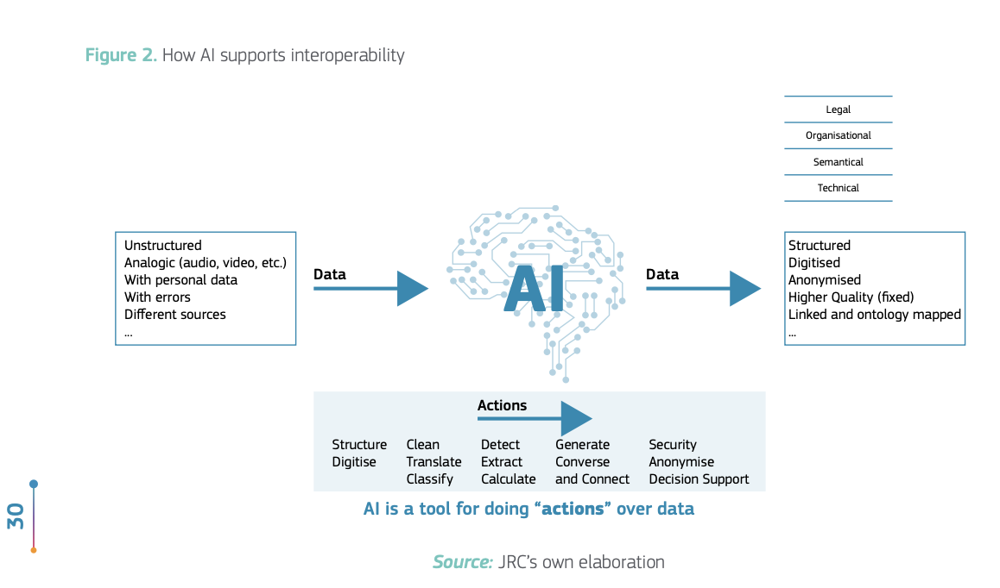
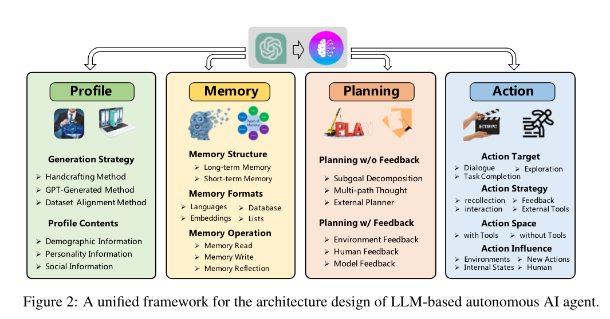

# taitac

<!-- WARNING: THIS FILE WAS AUTOGENERATED! DO NOT EDIT! -->

## Introduction

Trusted AI - Towards a Curator (TAITaC) is an initiative dedicated to
constructing metadata and curating data crucial for the development of
AI and for scientific research at large. This project is birthed from
the recognition that the landscape of AI and scientific research thrives
on reliable data, and that constructing reliable metadata and curating
such data automatically can revolutionize the way we approach research
and AI model development.

TAITaC is part of the Notre Dame Trusted AI Knowledge Engineering
project, TAITAC aims to explore the architectures needed for “Curator
AI’s”. The project’s home is the `nd-crane/taitac` repository on GitHub.

## Key Features for AI Agents

1.  **Automatic Metadata Generation**: Construct rich metadata for AI
    development, capturing necessary details and relationships.
2.  **Data Curation**: Automate the process of sorting, categorizing,
    and maintaining data, ensuring AI models and researchers have access
    to the best quality data.
3.  **Curator AI Architectures Experimentation**: Experiment and iterate
    on potential AI architectures to best serve the goals of data
    curation and metadata generation.

## The Need for AI Curators

[Tangi, Luca, Marco Combetto, BOSCH Jaume Martin, and MÜLLER Paula
Rodriguez. 2023. “Artificial Intelligence for Interoperability in the
European Public Sector.” JRC Publications Repository. October 4,
2023.](https://doi.org/10.2760/633646).

> “Moreover, the semantic interoperability layer is fundamental in most
> of the cases. In addition, ontologies and taxonomies combined with AI
> can help in establishing interoperability between different systems.
> The solutions analysed classify, detect and provide structure, among
> other actions performed on data. Hence, AI has the capability to
> standardise, clean, structure and increase the usage of large volumes
> of data, thus improving overall quality and making it easier to use
> and share between different systems.”

## Technology Stack

- **Language**: Python
- **Development Framework**: [nbdev](https://nbdev.fast.ai/)
- **Environment Management**:
  [miniforge](https://github.com/conda-forge/miniforge)
- **Development Environment**:
  [devcontainers](https://code.visualstudio.com/docs/remote/containers)
- **AI Interaction**: [llm python
  library](https://github.com/simonw/llms) (For Large Language Model
  APIs interaction)
- **Knowledge Graph**:
  [rdflib](https://rdflib.readthedocs.io/en/stable/index.html) (For RDF
  graph construction and querying)

## Getting Started

### Prerequisites

- Install [Python 3.9](https://www.python.org/downloads/) or higher.
- Install
  [miniforge](https://github.com/conda-forge/miniforge#download).
- Recommended: [Visual Studio Code](https://code.visualstudio.com/) with
  [devcontainers
  extension](https://marketplace.visualstudio.com/items?itemName=ms-vscode-remote.remote-containers).

### Setup and Installation

1.  Clone the `nd-crane/taitac` repository:

        git clone https://github.com/nd-crane/taitac.git
        cd taitac

2.  Set up the devcontainer environment (if using VS Code):

    - Open VS Code and open the project folder.
    - When prompted, reopen the folder in the devcontainer.

3.  Create a conda environment using miniforge:

        conda create -n taitac_env python=3.9
        conda activate taitac_env

4.  Install the required dependencies:

        pip install -r requirements.txt

### Usage

*To be added as the project progresses.*

## Contribution

We welcome contributions to the TAITAC project! If you’d like to
contribute, please see our [CONTRIBUTING.md](./CONTRIBUTING.md) for
guidelines and details.

## License

This project is licensed under the [MIT License](./LICENSE).

## Acknowledgments

- Notre Dame Trusted AI Knowledge Engineering project for providing the
  foundational context.
- All contributors and supporters of the project.

------------------------------------------------------------------------

For more details, updates, and discussions, please refer to the official
[GitHub repository](https://github.com/nd-crane/taitac) and the
associated issues and pull requests.

## Approach

Our approach is a comprehensive blend of modern technologies and
strategies to build a robust, interactive, and intelligent data
platform. At its core, it’s an ecosystem that harmonizes Knowledge
Graphs (KG) with cognitive capabilities of Large Language Models (LLM),
streamlined by efficient data interfaces like SPARQL, JSON-LD, and
OpenAPI.

## LLM Architecture Patterns for Agents

We roughly follow the unified framework for LLMs proposed by Wang et
al. (2021) to build our agents. The framework is shown below:

[Wang, Lei, Chen Ma, Xueyang Feng, Zeyu Zhang, Hao Yang, Jingsen Zhang,
Zhiyuan Chen, et al. 2023. “A Survey on Large Language Model Based
Autonomous Agents.” arXiv.](http://arxiv.org/abs/2308.11432)

## OpenAI Assistants API and Python SDK

OpenAI has announced a Agents framework called the [Assistants - OpenAI
API](https://platform.openai.com/docs/assistants/overview) that allows
users to build agents that can interact with humans. The components of
the assistants API roughly decomposes to the following Agent
Architectural Patterns:

| Unified Framework Component | Assistants API Equivalent | Description                                                                                         |
|-----------------------------|---------------------------|-----------------------------------------------------------------------------------------------------|
| Profile Module              | Assistant                 | Defines the AI’s attributes, capabilities, and personality, setting the stage for its interactions. |
| Memory Module               | Thread                    | Manages the history of interactions, storing and truncating messages to maintain context.           |
| Planning Module             | Run                       | Processes the current state and plans the next actions, deciding how to utilize messages and tools. |
| Action Module               | Message & Run Step        | Executes actions, generates responses, and may call tools to produce outputs or perform tasks.      |

State transitions in the Assistants API would involve changes in the
“Thread” as new “Messages” are added, and as the “Assistant” performs
new “Runs” and “Run Steps,” updating its current knowledge and planned
actions.

In addition to these framework components, the Assistants API also
provides a “Tool” component that allows the agent to perform tasks and
produce outputs through [OpenAI
Functions](https://platform.openai.com/docs/guides/function-calling) and
Retrieval Augmented Generation (RAG) models through document upload.

OpenAI has added python SDK examples to it’s cookbook [Assistants API
Overview (Python
SDK)](https://cookbook.openai.com/examples/assistants_api_overview_python)
and LLamaIndex has integrated [examples of using the Assistants
API](https://github.com/run-llama/llama_index/tree/main/docs/examples/agent)
including
[ReAct](https://github.com/run-llama/llama_index/blob/main/docs/examples/agent/react_agent.ipynb)
Agents.

## Planning and Action Modules

Simon Willison has a very simple blog post of implementing the [ReAct:
Synergizing Reasoning and Acting in Language
Models](https://react-lm.github.io/) in one of his TILs – [A simple
Python implementation of the ReAct pattern for
LLMs](https://til.simonwillison.net/llms/python-react-pattern). There
are some issues in using regular expressions to select the tool the LLM
want’s to use. If the response can be constrained using a grammar as
with the OpenAI model, more expressive response options are available.

The issue with the ReAct pattern is that it is course grained planning
and action. A new approach, called [ADaPT: As-Needed Decomposition and
Planning with Language Models](https://allenai.github.io/adaptllm/)
allows recursive decomposition of the planning and action steps as
needed by supporting logical operators within the task planning and
execution.

## Prompts for Column Type Extraction

[Column Type Annotation using ChatGPT](https://arxiv.org/abs/2306.00745)
is a novel approach to annotate the semantic types of table columns
using a large language model (LLM) called ChatGPT¹\[1\]. The proposed
method is based on the idea that a language model can be used to
generate natural language descriptions of table columns, which can then
be used to infer their semantic types. The method is evaluated on the
WikiTableQuestions dataset²\[2\] and achieves state-of-the-art
performance in zero-shot and few-shot settings.

- **Column Type Annotation using ChatGPT**: A novel approach to annotate
  the semantic types of table columns using a large language model (LLM)
  called ChatGPT¹\[1\].
- **Prompt Design and Evaluation**: Different ways to formulate prompts
  for the column type annotation (CTA) task and their performance in
  zero- and few-shot settings.
- **Explicit Instructions and Message Roles**: How to improve the
  performance of ChatGPT by providing step-by-step instructions and
  using message roles to distinguish between system, user, and AI
  messages²\[2\].
- **In-Context Learning**: How to further boost the performance of
  ChatGPT by providing task demonstrations as part of the prompt in
  one-shot and five-shot setups.
- **Two-Step Pipeline**: A proposed method to deal with large label
  spaces by first predicting the domain of the table and then using only
  the relevant subset of labels for CTA³\[3\].
- **Comparison to Baselines**: A comparison of ChatGPT to
  state-of-the-art CTA methods based on pre-trained language models
  (PLMs) such as RoBERTa and DODUO.

## DataSets for testing data curation

The [GitTables: A Large-Scale Corpus of Relational
Tables](https://arxiv.org/pdf/2106.07258.pdf) has constructed a test
data set of 1.5 million tables from GitHub. The data set is available
from \[GitTables\]( - [GitTables benchmark - column type
detection](https://zenodo.org/records/5706316)

## Testing and Evaluation

OpenAI uses the [Evals Framework](https://github.com/openai/evals) for
unit and behavior testing LLMs as a potential model for applying trusted
AI to the models. A informative blog post is at [Mastering OpenAI’s
‘evals’: A Deep Dive into Evaluating
LLMs](https://medium.com/@sergioli/evaluating-chatgpt-using-openai-evals-7ca85c0ad139)
and OpenAI touched on them during developer days [The New Stack and Ops
for AI](https://youtu.be/XGJNo8TpuVA?si=Yyh6dKTXouEXxvMf).
