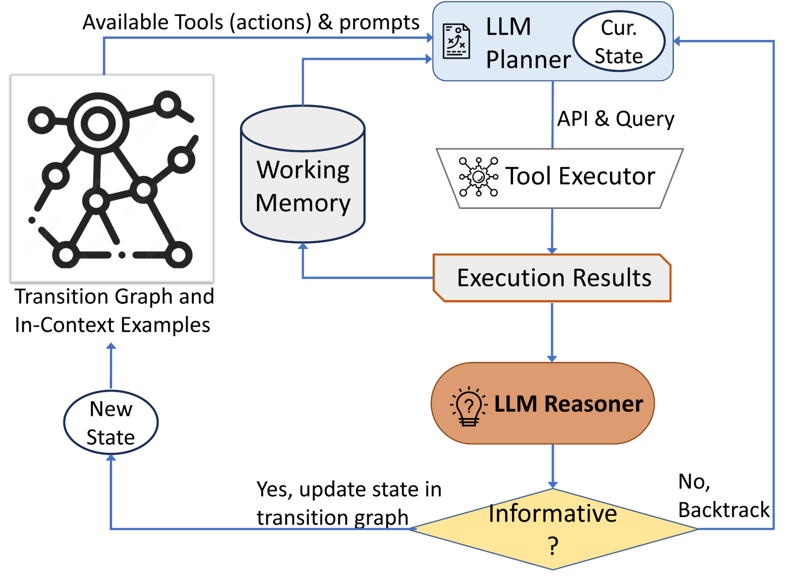

# taitac

<!-- WARNING: THIS FILE WAS AUTOGENERATED! DO NOT EDIT! -->

## Introduction

Trusted AI - Towards a Curator (TAITaC) is an initiative dedicated to
constructing metadata and curating data crucial for the development of
AI and for scientific research at large. This project is birthed from
the recognition that the landscape of AI and scientific research thrives
on reliable data, and that constructing reliable metadata and curating
such data automatically can revolutionize the way we approach research
and AI model development.

TAITaC is part of the Notre Dame Trusted AI Knowledge Engineering
project, TAITAC aims to explore the architectures needed for “Curator
AI’s”. The project’s home is the `nd-crane/taitac` repository on GitHub.

## Key Features for AI Agents

1.  **Automatic Metadata Generation**: Construct rich metadata for AI
    development, capturing necessary details and relationships.
2.  **Data Curation**: Automate the process of sorting, categorizing,
    and maintaining data, ensuring AI models and researchers have access
    to the best quality data.
3.  **Curator AI Architectures Experimentation**: Experiment and iterate
    on potential AI architectures to best serve the goals of data
    curation and metadata generation.

## The Need for AI Curators

## Technology Stack

- **Language**: Python
- **Development Framework**: [nbdev](https://nbdev.fast.ai/)
- **Environment Management**:
  [miniforge](https://github.com/conda-forge/miniforge)
- **Development Environment**:
  [devcontainers](https://code.visualstudio.com/docs/remote/containers)
- **AI Interaction**: [llm python
  library](https://github.com/simonw/llms) (For Large Language Model
  APIs interaction)
- **Knowledge Graph**:
  [rdflib](https://rdflib.readthedocs.io/en/stable/index.html) (For RDF
  graph construction and querying)

## Getting Started

### Prerequisites

- Install [Python 3.9](https://www.python.org/downloads/) or higher.
- Install
  [miniforge](https://github.com/conda-forge/miniforge#download).
- Recommended: [Visual Studio Code](https://code.visualstudio.com/) with
  [devcontainers
  extension](https://marketplace.visualstudio.com/items?itemName=ms-vscode-remote.remote-containers).

### Setup and Installation

1.  Clone the `nd-crane/taitac` repository:

        git clone https://github.com/nd-crane/taitac.git
        cd taitac

2.  Set up the devcontainer environment (if using VS Code):

    - Open VS Code and open the project folder.
    - When prompted, reopen the folder in the devcontainer.

3.  Create a conda environment using miniforge:

        conda create -n taitac_env python=3.9
        conda activate taitac_env

4.  Install the required dependencies:

        pip install -r requirements.txt

### Usage

*To be added as the project progresses.*

## Contribution

We welcome contributions to the TAITAC project! If you’d like to
contribute, please see our [CONTRIBUTING.md](./CONTRIBUTING.md) for
guidelines and details.

## License

This project is licensed under the [MIT License](./LICENSE).

## Acknowledgments

- Notre Dame Trusted AI Knowledge Engineering project for providing the
  foundational context.
- All contributors and supporters of the project.

------------------------------------------------------------------------

For more details, updates, and discussions, please refer to the official
[GitHub repository](https://github.com/nd-crane/taitac) and the
associated issues and pull requests.

## Approach

Our approach is a comprehensive blend of modern technologies and
strategies to build a robust, interactive, and intelligent data
platform. At its core, it’s an ecosystem that harmonizes Knowledge
Graphs (KG) with cognitive capabilities of Large Language Models (LLM),
streamlined by efficient data interfaces like SPARQL, JSON-LD, and
OpenAPI.

## Architecture Overview

### 1. Knowledge Graph (KG) Storage

#### Storage Layer

- Purpose: Store RDF triples/quads, which form the backbone of our
  knowledge representation.
- Technology: A specialized database optimized for RDF storage ensuring
  speed, scalability, and efficient querying.

#### SPARQL Endpoint

- Purpose: Provide an interface for querying the KG.
- Technology: A standard SPARQL endpoint ensuring compatibility with
  various tools and services.

### 2. Microservices Layer

#### SPARQL Service

- Purpose: Interface with the KG to fetch relevant data.
- Features:
  - Fetch data using SPARQL queries.
  - Convert query results, primarily to JSON-LD format for
    interoperability.

#### OpenAPI Service

- Purpose: Expose data and functionalities as RESTful services.
- Features:
  - Standard REST API endpoint allowing CRUD operations.
  - Integration points for third-party services and applications.

#### LLM Cognitive Agent Service

- Purpose: Provide intelligent, natural language processing
  capabilities.
- Features:
  - Process and understand natural language queries.
  - Interact with SPARQL and OpenAPI services.
  - Return comprehensive, human-friendly responses.
  - Learn and refine its knowledge based on continuous feedback.

### 3. Integration Middleware

#### JSON-LD Processor

- Purpose: Ensure semantic interoperability.
- Features:
  - Convert data between JSON-LD and other formats.
  - Support semantic annotations and context-aware data transformations.

#### Translator

- Purpose: Convert user queries into actionable data requests.
- Features:
  - Translate natural language queries into SPARQL or OpenAPI requests.
  - Employ contextual understanding to optimize data retrieval
    strategies.

### 4. User Interface (UI)

#### Web UI

- Purpose: Offer users an interactive platform to engage with the
  system.
- Features:
  - Send natural language queries.
  - Visualize KG data.
  - Receive and review responses from the LLM.

#### REST API Client

- Purpose: Programmable interface for developer interactions.
- Features:
  - Access to all underlying services for third-party integrations.
  - Build atop the platform for custom applications and utilities.

### 5. Feedback Mechanism

- Purpose: Continuously refine the LLM’s knowledge and accuracy.
- Features:
  - Users can provide feedback on LLM responses.
  - The feedback loop informs the learning process of the LLM Cognitive
    Agent Service.

### 6. Security and Authentication

- Purpose: Ensure safe and authorized access to data and services.
- Features:
  - Secure the OpenAPI and SPARQL endpoints.
  - Implement strategies like rate limiting, API keys, or OAuth
    mechanisms.

### 7. Scalability and Load Balancing

- Purpose: Handle large volumes of data and high concurrency gracefully.
- Features:
  - Distribute incoming traffic with load balancers.
  - Scale storage solutions based on data growth and query demands.

### 8. Logging and Monitoring

- Purpose: Maintain system health, track interactions, and optimize
  performance.
- Features:
  - Monitor service health and performance metrics.
  - Log interactions, errors, and anomalies for audit and continuous
    improvement.

------------------------------------------------------------------------

The proposed architecture ensures that users can fluidly interact with a
vast repository of knowledge using natural language. By converting
complex queries into actionable data points and leveraging the cognitive
prowess of LLMs, the system is designed to deliver accurate, concise,
and human-readable responses. In essence, it’s a forward-looking
blueprint that envisions a seamless blend of structured KGs with the
intuitive cognition of LLMs, underpinned by robust, scalable, and secure
services.

## Agent Architecture

### Initial Experiment Architecture from AVIS.

[AVIS: Autonomous Visual Information Seeking with Large Language Model
Agent](https://arxiv.org/abs/2306.08129) is a novel framework for visual
question answering that requires external knowledge. It consists of
three components: a planner, a reasoner, and a working memory. The
planner decides which tool to use next, such as web search, image
search, or computer vision. The reasoner analyzes the output of the tool
and extracts relevant information. The working memory stores the
acquired information and updates it as the process progresses. AVIS uses
a large language model to power both the planner and the reasoner, and
leverages user behavior data to guide its decision-making.

The tool use component of AVIS is responsible for selecting the most
appropriate external tool to obtain information from, based on the
current state and the question. AVIS supports three types of tools: web
search, image search, and computer vision. Web search queries a search
engine with keywords extracted from the question and returns a list of
web pages. Image search queries an image search engine with the image
provided by the user and returns a list of similar images. Computer
vision applies a pre-trained object detection model to the image and
returns a list of detected objects and their locations.

The state graph component of AVIS is responsible for defining the
possible states and transitions of the information seeking process. A
state is a representation of the current knowledge acquired by AVIS,
such as the question, the image, the tool outputs, and the working
memory. A transition is a change of state triggered by an action, such
as invoking a tool or updating the working memory. The state graph is
constructed by analyzing the user behavior data collected in a user
study, where human participants were asked to answer visual questions
that require external knowledge using various tools. The state graph
serves as a constraint for the planner to choose valid actions at each
state.

A summary of the Architecture is available from the Google Research Blog
[Autonomous visual information seeking with large language
models](https://blog.research.google/2023/08/autonomous-visual-information-seeking.html).

## Starting Use Case for AI Curator – CSV Column Type Annotation

[Column Type Annotation using ChatGPT](https://arxiv.org/abs/2306.00745)
is a novel approach to annotate the semantic types of table columns
using a large language model (LLM) called ChatGPT¹\[1\]. The proposed
method is based on the idea that a language model can be used to
generate natural language descriptions of table columns, which can then
be used to infer their semantic types. The method is evaluated on the
WikiTableQuestions dataset²\[2\] and achieves state-of-the-art
performance in zero-shot and few-shot settings.

- **Column Type Annotation using ChatGPT**: A novel approach to annotate
  the semantic types of table columns using a large language model (LLM)
  called ChatGPT¹\[1\].
- **Prompt Design and Evaluation**: Different ways to formulate prompts
  for the column type annotation (CTA) task and their performance in
  zero- and few-shot settings.
- **Explicit Instructions and Message Roles**: How to improve the
  performance of ChatGPT by providing step-by-step instructions and
  using message roles to distinguish between system, user, and AI
  messages²\[2\].
- **In-Context Learning**: How to further boost the performance of
  ChatGPT by providing task demonstrations as part of the prompt in
  one-shot and five-shot setups.
- **Two-Step Pipeline**: A proposed method to deal with large label
  spaces by first predicting the domain of the table and then using only
  the relevant subset of labels for CTA³\[3\].
- **Comparison to Baselines**: A comparison of ChatGPT to
  state-of-the-art CTA methods based on pre-trained language models
  (PLMs) such as RoBERTa and DODUO.

## CSV Datasets for AI Curator

[SOTAB V2 - Table Annotation
Benchmark](http://webdatacommons.org/structureddata/sotab/v2/) Code for
constructing the benchmark:
(https://github.com/wbsg-uni-mannheim/wdc-sotab): [GitTables: a
large-scale corpus of relational tables
download.](https://gittables.github.io/) [GitTables: A Large-Scale
Corpus of Relational Tables](https://arxiv.org/pdf/2106.07258.pdf) –
[GitHub](https://github.com/madelonhulsebos/gittables) [GitTables
Download](https://zenodo.org/records/4943312)

- **SOTAB V2**: A benchmark for **table annotation** using
  **Schema.org** and **DBpedia** terms. It covers two tasks: **Column
  Type Annotation (CTA)** and **Columns Property Annotation
  (CPA)**¹\[1\]. It consists of **45,834 tables** annotated for CTA and
  **30,220 tables** annotated for CPA from **55,511 websites**²\[2\].
- **Table annotation tasks**: The goal of CTA is to assign a type to
  each table column, such as telephone, Duration, or Organization³\[3\].
  The goal of CPA is to assign a property to each pair of columns, such
  as gtin, startDate, or recipeIngredient⁴\[4\].
- **Table annotation challenges**: The benchmark includes subsets of
  test tables that measure the performance of table annotation systems
  on specific challenges, such as missing values, value format
  heterogeneity, and corner cases.
- **Baseline methods**: Three methods are used to evaluate the
  benchmark: a non-deep learning method based on TF-IDF and Random
  Forest, a deep learning method called TURL that uses Transformer and
  TinyBERT, and a deep learning method called DODUO that uses BERT and
  table serialization.
- **Download and code**: The benchmark datasets and the code for
  building the benchmark are available for public download on
  github⁵\[5\]. The datasets are provided in JSON and CSV formats.
